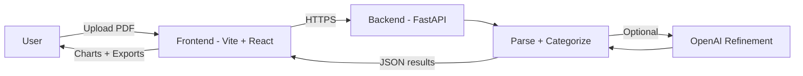

# Budget App

Personal finance statement parser + categorizer with a React (Vite + TypeScript) frontend and a Python FastAPI backend. Supports PDF bank statement ingestion, heuristic categorization into seven canonical buckets, CSV/Excel export, and optional OpenAI-powered refinement when enabled (descriptions only).

## Status
Active development. AWS deployment typically uses Elastic Beanstalk for the backend (FastAPI) and AWS Amplify for the frontend (React).

## Features (Current)
- PDF bank statement ingestion and parsing on the backend
- Rule-based categorization into seven canonical categories
- Optional custom category rules via JSON or runtime injection
- Unified financial overview (totals, averages, medians, net change)
- Filters for date range, category, and search
- CSV and Excel exports (transactions + summary)
- Optional OpenAI refinement (opt-in, description-only, cached)

## Architecture


## Quickstart
Backend (example):
```bash
cd backend
python -m venv .venv && source .venv/bin/activate
pip install -r requirements.txt
# Optional AI refinement (requires OpenAI client)
pip install openai
export USE_AI_CATEGORIES=1
export OPENAI_API_KEY=sk-your_key_here
export OPENAI_MODEL=gpt-4o
# The FastAPI entrypoint is `src.api:app` (module `backend/src/api.py`)
uvicorn src.api:app --reload
```

Frontend (example):
```bash
cd frontend
npm install
npm run dev
```

## Security & Secret Management

**Never commit secrets, API keys, credentials, or user data to this repository.**

- All sensitive configuration (e.g., Stripe keys, database URIs, email credentials) must be provided via environment variables or a cloud secret manager (e.g., AWS Secrets Manager).
- The `.gitignore` is configured to block common secret/config files, but always double-check before pushing.
- For AWS deployment (Elastic Beanstalk, Amplify), set secrets in the AWS console or use AWS Secrets Manager. The app reads secrets from environment variables at runtime.
- User data is never stored in the repo. All user-uploaded data is processed in memory and not persisted unless a future feature enables it (see privacy section below).

**If you ever accidentally commit a secret, rotate it immediately and remove it from the repo history.**

### Example: Setting Secrets for AWS

When deploying to AWS Elastic Beanstalk or Amplify, add environment variables for secrets (e.g., `STRIPE_API_KEY`, `DATABASE_URL`) in the respective AWS console under Environment variables or connect to AWS Secrets Manager.

**Do not put secrets in code or config files.**

## Legal & Policies
Public-facing policies live in the frontend static pages:

- Privacy Policy: https://mybudgetnerd.com/privacy.html
- Terms of Service: https://mybudgetnerd.com/terms.html
- Cookie Policy (no cookies used): https://mybudgetnerd.com/cookies.html
- Billing Policy (template for future payments): https://mybudgetnerd.com/billing.html

MyBudgetNerd is a product of Athena Data Labs (https://athenadatalabs.com). Copyright holder: Athena Analytics LLC.

## Privacy & Data Handling (Summary)
- PDFs are processed in memory and not stored by default.
- No analytics or tracking cookies are used.
- Optional AI refinement is opt-in and sends only transaction descriptions.

Full details: docs/privacy.md

## AWS Deployment

### Backend (FastAPI) — Elastic Beanstalk
- Deploy the backend using AWS Elastic Beanstalk (Python environment).
- Set environment variables and secrets in the Elastic Beanstalk console or connect to AWS Secrets Manager.
- Elastic Beanstalk manages scaling, health checks, and rolling deployments.

### Frontend (React) — AWS Amplify
- Deploy the frontend using AWS Amplify Console (connect your GitHub repo, select the frontend directory).
- Configure build settings as needed (Amplify auto-detects most React/Vite setups).
- Set environment variables in the Amplify Console for any frontend secrets (never expose backend secrets to frontend).
- Amplify provides hosting, SSL, and CI/CD from your repo.

### General AWS Notes
- In production, ensure the frontend is configured to call the correct API endpoint (Elastic Beanstalk backend URL).

The React frontend is deployed independently on AWS Amplify (static hosting). The FastAPI backend runs on Elastic Beanstalk.

1. Deploy the backend to Elastic Beanstalk (Python platform).
2. In Amplify console, set environment variable `VITE_API_BASE` to the backend base URL (e.g. `https://api.mybudgetnerd.com`). Do NOT include a trailing slash.
3. Rebuild Amplify. The frontend constructs API calls with:
	- Production: `https://.../parse` (etc.)
	- Local dev (no `VITE_API_BASE`): `/api/parse` which is proxied to `localhost:8000` by `vite.config.ts`.

Optional additional origins for CORS may be appended via backend env var `API_CORS_ORIGINS` (comma separated). The backend already includes `mybudgetnerd.com` and `www.mybudgetnerd.com` in production.


## License
This project is published under the Business Source License 1.1 (BSL).
The repository source is visible for review and development, but
production/commercial use is restricted until the Change Date
(`2036-09-17`) when the code will automatically convert to the
Apache License 2.0. To request a commercial license prior to that
date, contact: `athena.analytics.llc@gmail.com`.

See `LICENSE` and `LICENSE-COMMERCIAL.md` for details.

